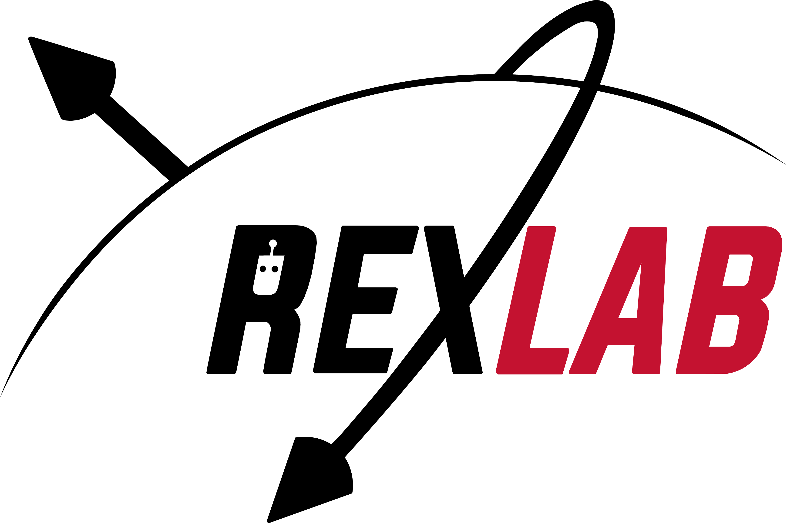

# 🛰️ SALTRO

**Satellite Augmented Lagrangian Trajectory Optimizer** is a lightweight, flight-ready attitude trajectory optimizer for satellite pointing. It is built on the [ALTRO](https://bjack205.github.io/assets/ALTRO.pdf) trajectory optimizer. 

Given a goal sequence, SALTRO will calculate an optimal, dynamically feasible trajectory for the satellite and the required inputs to satellite actuators to follow that trajectory. 

## ✨ Key Features
- ✅ Compatible with heterogeneous and underactuated actuator sets, including magnetorquers (MTQ), reaction wheels (RW), and thrusters
- ✅ Inclusion of actuator, pointing, and desaturation constraints
- ✅ Generated trajectories are always dynamically feasible
- ✅ Python interface for triggering via [Generalized ADCS](https://github.com/nscheuer/Generalized_ADCS) or testing
- ✅ Meant for flight processors; safety features including non-blocking, sequential execution

## 📚 Academic Background

This project builds on the following foundational work:

### 1️⃣ ALTRO: A Fast Solver for Constrained Trajectory Optimization
- 📄 Paper:  
  *ALTRO: A Fast Solver for Constrained Trajectory Optimization*  
  https://bjack205.github.io/assets/ALTRO.pdf  
- 💻 Code (Julia):  
  https://github.com/RoboticExplorationLab/ALTRO.jl  

### 2️⃣ Magnetorquer-Only Attitude Control of Small Satellites using Trajectory Optimization
- 📄 Paper:  
  *Magnetorquer-Only Attitude Control of Small Satellites using Trajectory Optimization*  
  https://www.ri.cmu.edu/app/uploads/2020/06/magnetorquer_only.pdf 

### 3️⃣ Patrick McKeen — Dissertation & Project Code  
- 📄 Dissertation:  
  *Computational Methods to Improve Satellite Attitude Determination and Control  
  with a Focus on Autonomy, Generalizability, and Underactuation*  
  https://dspace.mit.edu/handle/1721.1/158874  

- 💻 Source Code:  
  https://github.com/patrickmckeen/PhD_Dissertation_Code