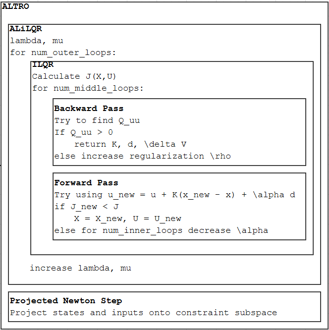

The working principle behind SALTRO
===================================

SALTRO, as in the name, uses the `Augmented Lagrangian TRajectory Optimizer <https://bjack205.github.io/assets/ALTRO.pdf>`_ (Howell et al., 2020) for specifically the satellite attitude (pointing) problem.

.. raw:: html

   <object data="../_static/ALTRO.pdf#page=1"
           type="application/pdf"
           width="100%"
           height="600px">

       

   </object>

ALTRO iteratively refines a trajectory by solving fast local optimal control problems while progressively enforcing constraints via an augmented Lagrangian, combining the speed of iLQR/DDP with robust constraint satisfaction.

Pseudocode
----------

Derivation
----------
This is a detailed version of the ALTRO derivation, specifically the AL-iLQR step, based on `ALTRO: A Fast Solver for Constrained Trajectory Optimization <https://bjack205.github.io/assets/ALTRO.pdf>`_ (Howell et al., 2020) and `AL-iLQR Tutorial <https://bjack205.github.io/papers/AL_iLQR_Tutorial.pdf>`_ (Jackson, 2020).

.. toctree::
   :maxdepth: 1

   derivation/1_iLQR
   derivation/2_AL
   derivation/3_ALiLQR
   derivation/4_line_search
   derivation/5_cholesky
   derivation/6_newton