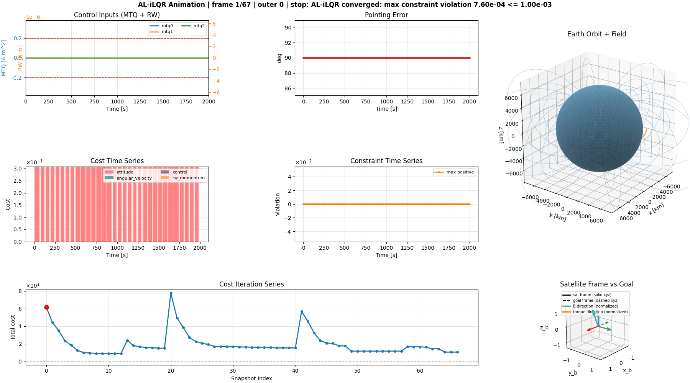
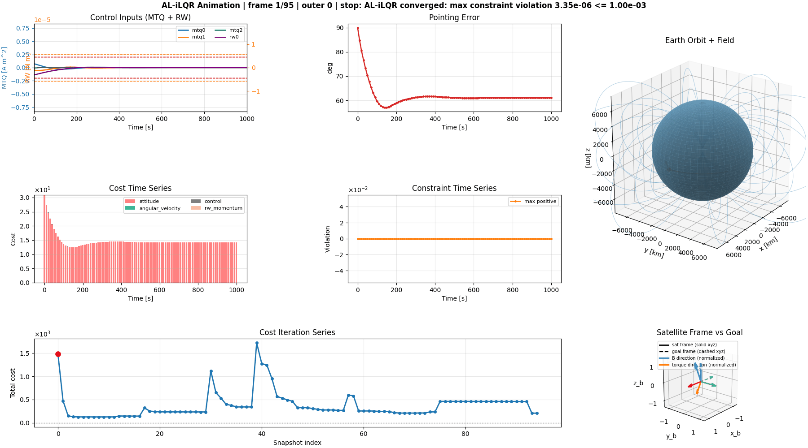

Satellite Augmented Lagrangian Trajectory Optimization (SALTRO)
===============================================================

GitHub repository: `nscheuer/SALTRO <https://github.com/nscheuer/SALTRO>`_

SALTRO is a high-performance trajectory optimizer for satellite attitude control.

Using trajectory planning and advance knowledge of the magnetic field, it is for instance **able to slew a MTQ-only satellite within one orbit**, a task that usually takes multiple.

SALTRO's predecessor flew on the MIT STAR Lab "BeaverCube 1" mission. SALTRO has a performance improvement of approximately 50x compared to the previous version and is intended for **onboard computation**.

.. list-table:: Compute times for a 3 MTQ satellite over 5400 seconds, 10 second timestep
   :header-rows: 1
   :widths: 40 30 30

   * - CPU
     - Algorithm
     - Compute Time
   * - i9-13900K
     - BC2 SALTRO
     - 0.782 s
   * - i9-13900K
     - BC1 trajectory optimizer
     - 50+ s

Furthermore, SALTRO **supports hybrid magnetorquer + reaction wheel architectures**, with interesting results like the below pointing maneuver that uses three magnetorquers and one reaction wheel:

Links
-----
.. toctree::
   :maxdepth: 1

   The working principle behind SALTRO <datasheets/ALTRO>
   Installation <datasheets/Installation>
   OBC (FC) usage guide <datasheets/FC>

Documentation
-------------

.. toctree::
   :maxdepth: 1

   Code Documentation <code_documentation>
   Convergence Logic Tree <convergence_logic_tree>
   Optimizer Settings Reference <datasheets/optimizer_settings>
