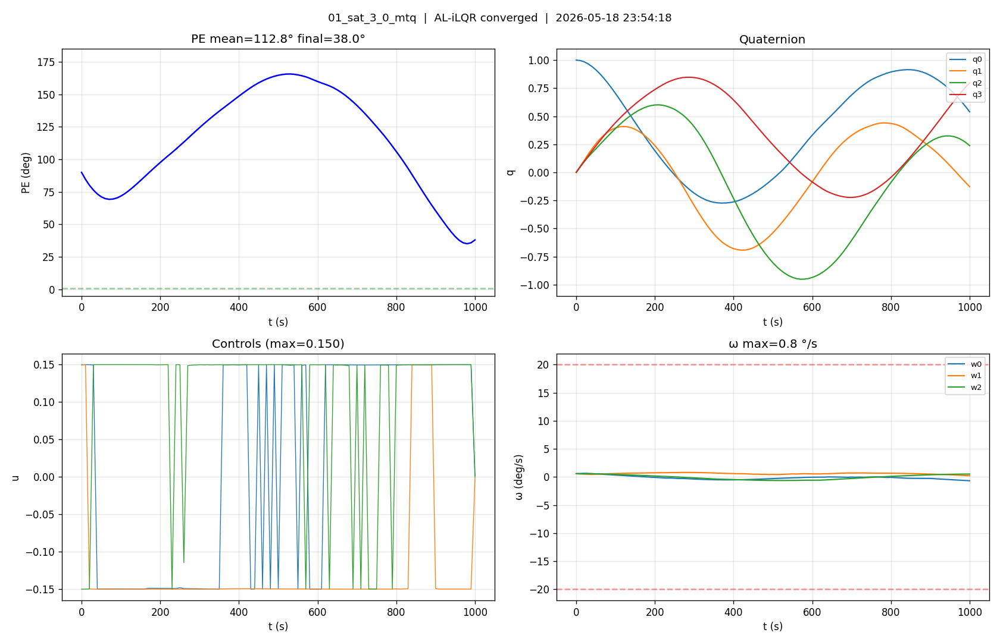

# MTQ early-window experiment (case 01)

`WIDE_MTQ_EARLY_WINDOW=25` — allow MTQ-only spike substitutions during
iters 2..24, then revert to auto-skip.

Result: PE_fin=38° (worse than baseline auto-skip's 9°), but trajectory
is **smooth** (single arc 0→170°→30°) instead of oscillating around goal.

Substitutions did smooth the trajectory but removed the
"oscillating-around-goal" mechanism MTQ-only relies on to repeatedly
cross goal orientation.

[midway grid](01_sat_3_0_mtq_midway.png) · [animation](01_sat_3_0_mtq.gif)
